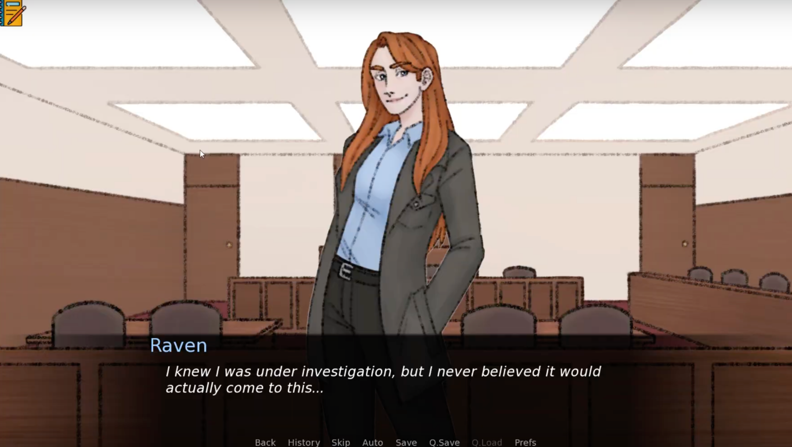

# DocsToRenPy



A lightweight script that converts scriptwriting drafts exported from Google Docs (in Markdown format) directly into Ren'Py (`.rpy`) scene files.

Writing dialogue and scene flow in Google Docs is fast for writers, but manually reformatting everything into Ren'Py syntax takes hours. This tool parses formatted Markdown files and outputs Ren'Py labels, dialogue, character show/hide statements, background switches, audio calls, and menu choices automatically.

## How It Works

The parser scans all `.md` files in the `input/` folder, reads formatted text according to specific tags (character dialogue, background tags, audio cues, and scene transitions), and generates:

- `scene_files/`: A folder containing `.rpy` script files for each scene and ending.
- `filenames.txt`: A list of all unique background images, character sprites, and sound effects found in the text, so you know which assets need to be added to your Ren'Py project.

## Requirements

- Python 3.10+
- `pytest` (optional, for running tests)

No external libraries are required to run the main script—it uses Python standard library modules (`re`, `os`).

## How to Use

1. Export your Google Doc screenplay as Markdown (`.md`) and drop the file into the `input/` folder.
2. Run the conversion script:

```bash
python src/docs_to_renpy.py
```

3. Check the `scene_files/` directory for your generated Ren'Py scripts and `filenames.txt` for your asset checklist.

## Writing in Google Docs

You do not need to write raw Markdown. Write your screenplay in Google Docs using standard rich-text formatting, bolding, and headings. When exported via `File > Download > Markdown (.md)`, Google Docs automatically generates the format this tool expects.

### Google Docs Formatting Reference

| Element            | How to Format in Google Docs                              | Example in Google Docs                                                              | Output in Ren'Py                                       |
| ------------------ | --------------------------------------------------------- | ----------------------------------------------------------------------------------- | ------------------------------------------------------ |
| **Scene Start**    | Set text to **Heading 2** with `Scene:`                   | `Scene: Intro` _(Heading 2)_                                                        | `label intro:`                                         |
| **Ending**         | Set text to **Heading 2** with `Ending:`                  | `Ending: True End` _(Heading 2)_                                                    | `label true_end:`                                      |
| **Subscene**       | Set text to **Heading 3** with `Subscene:`                | `Subscene: Park Chat` _(Heading 3)_                                                 | `label park_chat:`                                     |
| **Dialogue**       | **Bold** the character name and optional emotion          | **Alice (happy):** Good morning!                                                    | `show alice happy`<br>`alice "Good morning!"`          |
| **Narration**      | **Bold** the word **Narration:**                          | **Narration:** The rain stopped.                                                    | `"The rain stopped."`                                  |
| **Phone Call**     | Write `(Phone)` before the bold character name            | (Phone)**Bob:** Can you hear me?                                                    | `show bob silhouette`<br>`bob "Can you hear me?"`      |
| **Background**     | Enclose in square brackets with `Background:`             | `[Background: Classroom]`                                                           | `scene bg classroom`                                   |
| **Scene Jump**     | Enclose in square brackets with `Go to Scene:`            | `[Go to Scene: Lunchtime]`                                                          | `jump lunchtime`                                       |
| **Sound / Music**  | Enclose in square brackets with `Sound:` or `play music:` | `[Sound: Bell rings]`<br>`[play music: Theme]`                                      | `play sound bell_rings`<br>`play music theme`          |
| **Choices**        | Standard numbered list (`1.`, `2.`)                       | `1. Go home`<br>`2. Stay at school`                                                 | `menu:`<br>`    "Go home":`<br>`    "Stay at school":` |
| **Show Map**       | Enclose `[Show Map]` in square brackets                   | `[Show Map]`                                                                        | `call screen map()`                                    |
| **Tracking Lists** | Enclose in square brackets with quotes                    | `[Notebook Entry Added: "Secret Note"]`<br>`[Glossary Entry Added: "Visual Novel"]` | Appends entry to notebook or glossary lists            |

### Sample Google Docs Page

Here is how a scene page looks in Google Docs:

> **Scene: School Day** _(Styled as Heading 2)_
>
> [Background: Classroom]
>
> [Sound: Bell rings]
>
> **Alice (happy):** Good morning, everyone!
>
> **Bob:** Good morning, Alice. Did you finish the assignment?
>
> 1. Yes, I finished it yesterday.
> 2. No, I forgot about it.
>
> **Narration:** Alice checked her bag for her notes.
>
> [Go to Scene: Lunchtime]

Export this document from Google Docs with `File > Download > Markdown (.md)`, put the exported file in `input/`, and run the script.

## Running Tests

To run the automated test suite:

```bash
python -m pytest
```
